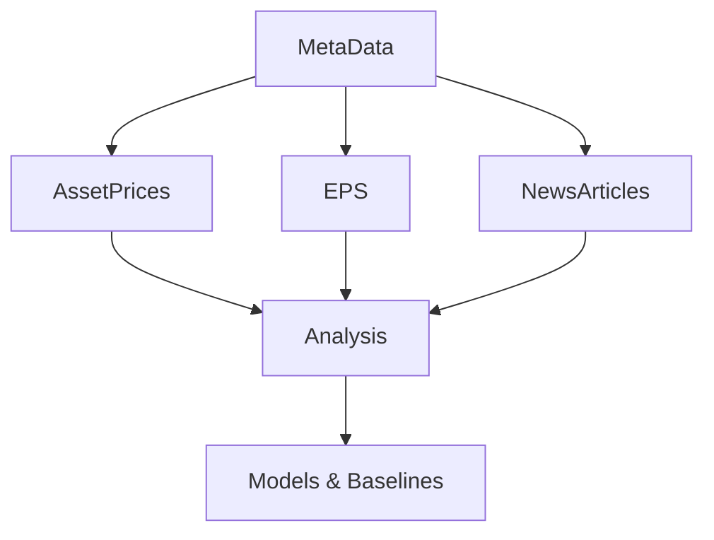

# DataAssembly Directory

The DataAssembly directory contains a comprehensive suite of data collection, processing, and assembly tools for financial research. This system gathers data from multiple sources including SEC filings, financial APIs, news articles, and market data to create a unified dataset for earnings prediction and financial analysis research.

## Directory Overview

```
DataAssembly/
├── README.md                    # This file
├── AssetPrices/                 # Historical stock price data collection
├── EPS/                        # Earnings per share data extraction
├── MetaData/                   # Company metadata and filtering
└── NewsArticles/               # Financial news processing and analysis
```

## Data Collection Architecture

The DataAssembly system follows a modular architecture where each subdirectory handles a specific type of financial data:

### 1. MetaData/ - Company Universe Definition
**Purpose**: Establishes the foundation by defining which companies to include in the research universe.

**What it collects**:
- S&P 500 company lists from Wikipedia
- Company metadata (names, sectors, tickers)
- Sector filtering (Information Technology, Consumer Discretionary, Financials)
- Data availability validation

**Key outputs**:
- `filtered_sp500_metadata.csv`: Curated list of companies for analysis
- Validated company universe with sufficient historical data

**Integration**: Provides the company universe that all other modules filter against.

### 2. AssetPrices/ - Market Data Collection
**Purpose**: Collects and manages historical stock price data for the defined company universe.

**What it collects**:
- Historical stock prices from Yahoo Finance
- Market benchmark data (SPY)
- Trading day information
- Price data for calculating returns and abnormal returns

**Key outputs**:
- SQLite database with daily price data
- Cumulative Abnormal Returns (CAR) calculations
- Post-Earnings Announcement Drift (PEAD) analysis
- Historical price visualizations

**Integration**: Provides price data for calculating market reactions to earnings announcements.

### 3. EPS/ - Earnings Data Extraction
**Purpose**: Extracts earnings per share (EPS) estimates and actual results from multiple sources.

**What it collects**:
- EPS estimates and surprises from Finnhub API
- EPS data from SEC 10-K and 10-Q filings using LLM parsing
- Quarterly earnings data with timestamps
- Earnings announcement dates and results

**Key outputs**:
- `eps_estimates_quarterly_2012_2024.csv`: Historical EPS estimates
- `eps_surprises_quarterly_2012_2024.csv`: EPS surprises and actual results
- Parsed SEC filing data with earnings information

**Integration**: Provides the fundamental earnings data that drives the prediction targets.

### 4. NewsArticles/ - News and Event Processing
**Purpose**: Processes financial news articles to extract structured events and sentiment.

**What it collects**:
- Financial news articles from external datasets
- Company mentions and relationships
- Event extraction using Large Language Models
- Sentiment analysis using FinBERT
- Event clustering and categorization

**Key outputs**:
- `facts_output.jsonl`: Structured events extracted from news
- `cluster_centroids.jsonl`: Event type clusters
- Sentiment scores and company relationships
- Cleaned and processed news datasets

**Integration**: Provides textual features and event information for the prediction models.

## Data Flow and Dependencies

### Sequential Processing Pipeline



### 1. Foundation Phase (MetaData)
- **Input**: Wikipedia S&P 500 data
- **Process**: Filter by sectors, validate data availability
- **Output**: Curated company universe
- **Dependencies**: None (starting point)

### 2. Market Data Phase (AssetPrices)
- **Input**: Company universe from MetaData
- **Process**: Download historical prices, calculate returns
- **Output**: Price database and return calculations
- **Dependencies**: MetaData (company list)

### 3. Earnings Data Phase (EPS)
- **Input**: Company universe from MetaData
- **Process**: Extract EPS data from APIs and SEC filings
- **Output**: Earnings estimates, surprises, and announcements
- **Dependencies**: MetaData (company list)

### 4. News Processing Phase (NewsArticles)
- **Input**: Raw news datasets, company universe
- **Process**: Clean, extract events, analyze sentiment
- **Output**: Structured events and sentiment data
- **Dependencies**: MetaData (company filtering)

### 5. Integration Phase
- **Input**: All processed data from above phases
- **Process**: Combine datasets, create features
- **Output**: Unified dataset for modeling
- **Dependencies**: All previous phases

## Data Quality and Validation

### Cross-Module Validation
- **Company Consistency**: All modules use the same company universe
- **Date Alignment**: Ensures temporal consistency across data sources
- **Data Completeness**: Validates sufficient data coverage for each company
- **Format Standardization**: Consistent data formats across modules

### Quality Assurance Features
- **Data Validation**: Each module validates its input data
- **Error Handling**: Robust error handling and recovery
- **Progress Tracking**: Comprehensive logging and progress monitoring
- **Resume Capability**: Ability to resume interrupted processes

## Configuration and Dependencies

### Centralized Configuration
All modules use the project-wide configuration system defined in `config.py`:

```python
# Company universe
METADATA_CSV_FILEPATH = "Data/filtered_sp500_metadata.csv"

# Price data
DB_PATH = "Data/momentum_data.db"
PRICING_TABLE_NAME = "daily_prices"

# EPS data
EPS_DATA_CSV = "Data/eps_data.csv"
EPS_ESTIMATES_CSV = "Data/eps_estimates_quarterly_2012_2024.csv"

# News data
NEWS_CSV_PATH_CLEAN = "Data/news_formatted_rows_clean.csv"
NEWS_FACTS = "Data/facts_output.jsonl"
```

### Shared Dependencies
- **pandas**: Data manipulation across all modules
- **numpy**: Numerical computing
- **sqlite3**: Database operations
- **requests**: API calls
- **openai**: LLM integration for text processing
- **transformers**: NLP models for sentiment analysis

## Usage Examples

### Complete Data Assembly Pipeline
```python
# 1. Define company universe
from DataAssembly.MetaData.company_names import main as setup_metadata
setup_metadata()

# 2. Collect price data
from DataAssembly.AssetPrices.build_pricing_db import create_pricing_db
create_pricing_db()

# 3. Extract EPS data
from DataAssembly.EPS.finnhub_extractor import main as extract_eps
extract_eps()

# 4. Process news articles
from DataAssembly.NewsArticles.article_fact_extractor import main as extract_facts
extract_facts()
```

### Individual Module Usage
```python
# Price data analysis
from DataAssembly.AssetPrices.build_pricing_db import plot_average_pead_from_csv
plot_average_pead_from_csv("earnings_data.csv")

# EPS data extraction
from DataAssembly.EPS.parse_10k_filings import parse_10k_filings
parse_10k_filings("10k_filings.csv")

# News sentiment analysis
from DataAssembly.NewsArticles.finBERT_sentiment import finbert_sentiment
result = finbert_sentiment("Apple reported strong earnings")
```

## Data Outputs and Integration

### Primary Outputs
1. **Company Universe**: `filtered_sp500_metadata.csv`
2. **Price Database**: `momentum_data.db` (SQLite)
3. **EPS Data**: `eps_estimates_quarterly_2012_2024.csv`, `eps_surprises_quarterly_2012_2024.csv`
4. **News Events**: `facts_output.jsonl`
5. **Event Clusters**: `cluster_centroids.jsonl`

### Integration Points
- **Analysis Module**: Uses all assembled data for model training and evaluation
- **Baselines Module**: Accesses price and EPS data for benchmark comparisons
- **KG Module**: Uses news events and sentiment for knowledge graph construction
- **Explainability Module**: Analyzes model predictions using all data sources

## Performance and Scalability

### Optimization Strategies
- **Parallel Processing**: Async processing for API calls and LLM inference
- **Streaming**: Memory-efficient processing of large datasets
- **Caching**: Model and data caching to avoid redundant operations
- **Batch Operations**: Efficient batch processing where possible

### Scalability Features
- **Modular Design**: Each module can be scaled independently
- **Resume Capability**: Long-running processes can be resumed
- **Progress Tracking**: Real-time progress monitoring
- **Error Recovery**: Robust error handling and recovery mechanisms

## Research Applications

### 1. Earnings Prediction
- **Target Variables**: EPS surprises and post-earnings returns
- **Features**: Historical prices, news sentiment, event types
- **Models**: GNN models using all data sources

### 2. Market Analysis
- **PEAD Research**: Post-earnings announcement drift analysis
- **Sentiment Impact**: News sentiment correlation with returns
- **Event Studies**: Market reaction to different event types

### 3. Academic Research
- **Reproducibility**: Standardized data collection and processing
- **Data Quality**: High-quality, validated datasets
- **Extensibility**: Modular design for research extensions

## Maintenance and Updates

### Regular Updates
- **Company Universe**: Quarterly updates to S&P 500 composition
- **Price Data**: Daily updates for new trading data
- **EPS Data**: Quarterly updates for new earnings announcements
- **News Data**: Continuous processing of new articles

### Data Validation
- **Automated Checks**: Regular validation of data quality
- **Consistency Checks**: Cross-module data consistency validation
- **Error Monitoring**: Automated error detection and reporting

## Notes

- All modules are designed for both research and production use
- The system maintains data lineage and provenance
- Comprehensive logging and monitoring throughout the pipeline
- Modular architecture allows for easy extension and modification
- Integration with the broader research pipeline for comprehensive analysis
- Designed to handle large-scale financial datasets efficiently
- Robust error handling and recovery mechanisms throughout
- Clear separation of concerns with well-defined interfaces between modules
